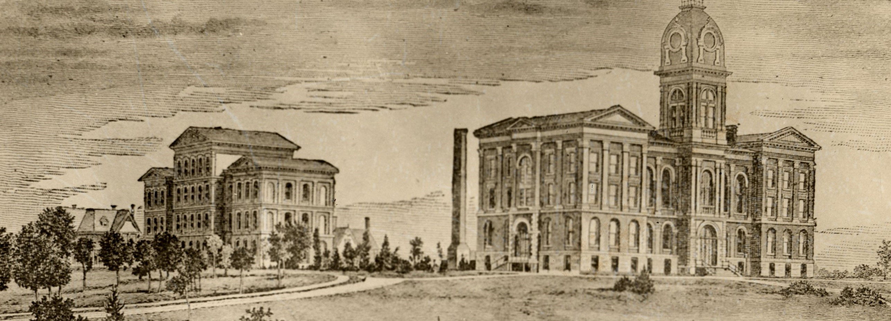
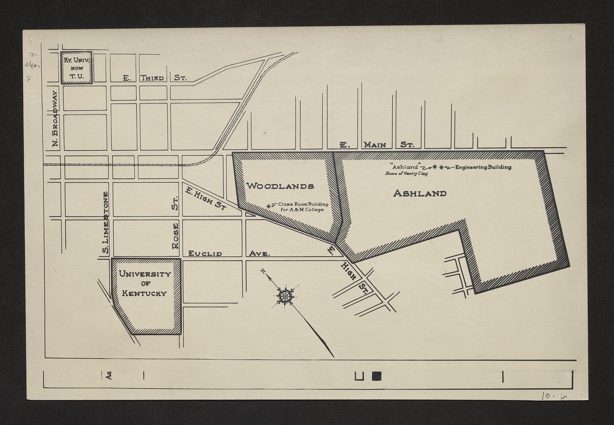
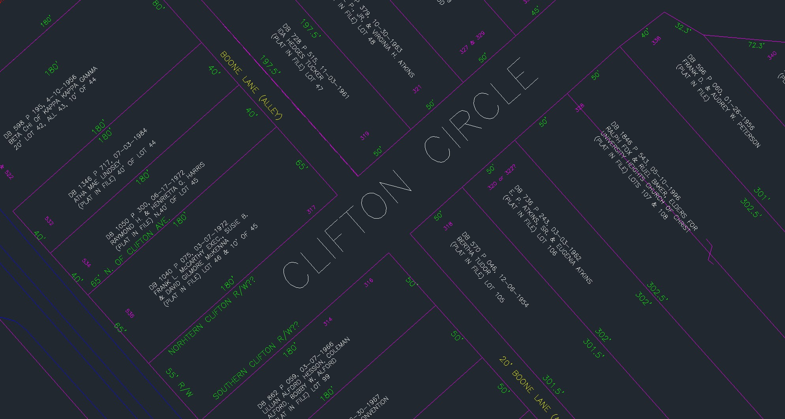
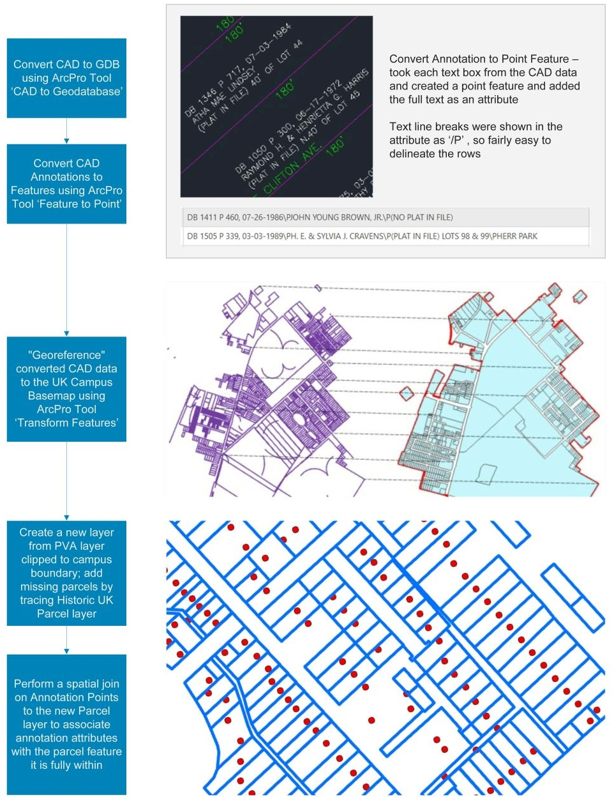
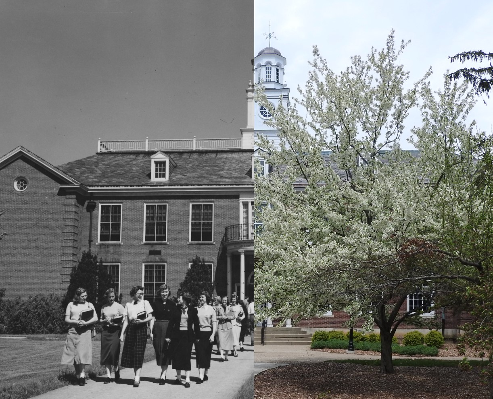

# Experience the History and Expansion of UK Campus | University of Kentucky
<!--a history of campus expansion-->
<!-- TOC -->

  - [I. Introduction](#i-introduction)
  - [II. Methodology](#ii-methodology)
    - [A. Data & Processing](#a-data--processing)
    - [B. Rephotography](#b-rephotography)
    - [C. Design - Application Layout](#c-design---application-layout)
    - [D. Technology Stack](#d-technology-stack)
  - [III. Conclusion](#iii-conclusion)
  - [IV. References](#iv-references)

<!-- /TOC -->

## I. Introduction

The University of Kentucky was founded in 1865. The original campus however was actually at the Ashland, the University did not move to its current location off of Nicholasville and Avenue of Champions until the 1880s. Ashland was sold to the John Bryan Bowman (founder of Kentucky University and Agricultural and Mechanical College of Kentucky) as a campus for the University in 1864, the wife of James B. Clay (son of Henry Clay) could no longer afford to stay at Ashland after her husband passed. 

UK separated from the private Kentucky University (Transylvania University today) to become a public institution under the Morrill Land Grant in 1865. Once UK separated they needed to obtain a campus, there was a state wide bidding war for the University to move to their cities. To encourage UK to stay in Lexington, Fayette County offered $20,000 and the city offered $30,000 and a large fairground (original campus). The university's permanent location was declared Lexington in 1880, and construction of the original campus began. Campus as it is known today opened in 1882 with three buildings: Main Building, White Hall Dormitory, and President Patterson's House. The main building is the only original structures still standing, White Hall Dormitory at Patterson House were demolished for the construction of Patterson Office Tower and White Hall Classroom Building in the 1960s. Since main campus opened there have been major changes to the campus landscape, and campus continues to acquire property for further expansion. 

  **[[University of Kentucky historical map, showing the Ashland and Limestone campuses from 1862-1882](https://exploreuk.uky.edu/catalog/xt7rn872zc2f)**

In my current position with UK Information Services group, I work closely with Facilities Management and Library datasets. Prior to development of this interactive map, older property deed details were fairly inaccessible and could only be located by searching through physical deeds in the Facilities Library. More recent parcel data can be obtained from LFUCG PVA; but the PVA merged older sections of campus into large parcels, instead of showing the original parcel size the property was purchased at. We have some historic parcel data in a CAD DWG document that was being maintained by an individual in Facilities Management, but it is not in an easily accessible format or location. As a part of this project I geospatially referenced and digitized the data from the CAD document so it could be used as a layer for this interactive map. I created this map to allow users to easily explore UK parcel details and how campus has grown, while also examining how the campus landscape has changed over the decades through rephotography images. 

## II. Methodology
This project combines modern PVA parcel data with historic UK property acquisitions to develop a unique dataset.  UK basemap features were provided from **[UK ITS Information Services - Geospatial](https://www.uky.edu/gissupport/sites/www.uky.edu.gissupport/files/Campus_Feature_Descriptions_0.pdf )**. Historic UK parcel data was provided by UK Facilities Management & UK ITS Information Services - Facilities Library. Modern Fayette County Parcel Data was sourced from **[Lexington Fayette Urban County Government (LFUCG)](https://data-lfucg.hub.arcgis.com/datasets/e4a525d8772741468205e82fc173db22_0/about)**. Points of Interest are based on selected historic photos of UK campus from UK Libraries **[Explore UKY](https://exploreuk.uky.edu/)**. Additional information about the data and processing methods can be found below.  

### A. Data & Processing
**UK Ownership Boundary**
(UK ITS Information Services - Geospatial)

**UK Basemap Features**
(UK ITS Information Services - Geospatial)
  - https://www.uky.edu/gissupport/sites/www.uky.edu.gissupport/files/Campus_Feature_Descriptions_0.pdf 
  - File created on UKY GIS Support Data page - September 29, 2021
  - Downloaded on February 2, 2022 as shapefiles	- Consists of: UK Buildings, Pavement, Road Centerline, Acquisition Boundary
  - Downloaded shapefile in projection NAD 1983 StatePlane Kentucky FIPS 1600 (US Feet) --> converted projection to WGS 1984, 4326, EPSG using Geoprocessing ArcPro 'Project Tool' 
   - Converted shapefile to a geoJSON using the ArcPro Geoprocessing Tool 'Features to JSON'
  - The information contained in this file is from multiple data sources maintained by the University of Kentucky’s ITS Information Services

**Fayette County Parcel Data**
(LFUCG)
  - https://data-lfucg.hub.arcgis.com/datasets/e4a525d8772741468205e82fc173db22_0/about
  - File created on LFUCG HUB - January 4, 2022
  - Downloaded on February 2, 2022 as a shapefile
  - Downloaded shapefile in WGS 1984, 4326, EPSG
  - Converted shapefile to a geoJSON using the ArcPro Geoprocessing Tool 'Features to JSON'
  - Clipped parcel data to the UK Ownership layer (UK Basemap Features) using the ArcPro Geoprocessing Tool 'Clip Layer' to reduce size of data 
  - Credits: LFUCG GIS, LFUCG Addressing, LFUCG Planning, Fayette County Property Valuation Administrator (PVA)

**Historic UK Parcel CAD Data**
(UK Facilities Management & UK ITS Information Services - Facilities Library)
  - Original data was developed using existing deed and plat information - NOT SURVEY QUALITY 
  - Parcel attributes were taken from the deeds and/or existing subdivision plats
  - Data is not complete and only shows parcels as described when they were conveyed to UK and does not show subsequent sales for road widening, easements, etc.
  

**UK Parcel Acquisition Data (NEW DATASET)**
(UK ITS Information Services - Geospatial)
  - Converted Historic UK Parcel CAD Data to GDB using the ArcPro Geoprocessing Tool 'CAD to Geodatabase'
  - CAD data was not in a projected space, assigned the converted data a projection of WGS 1984, 4326, EPSG
  - "Georeferenced" converted CAD data to the UK Campus Basemap using the Geoprocessing ArcPro Tool 'Transform Features'- created links between the converted CAD data and GIS campus basemap (see images below)
  - Converted georeferenced CAD Annotations to a point feature class using the Geoprocessing ArcPro Tool 'Feature to Point' 
  - After georeferencing the Historic UK Parcel CAD data to the GIS UK basemap, created a new feature class (UK Parcel Acquisition) from the Fayette County Parcel data and added/edited new features from georeferenced Historic UK Parcels 
  - Combined the dataset attributes by performing a spatial join using the ArcPro Geoprocessing Tool 'Spatial Join', joined georeferenced CAD Annotation points to the new UK Parcel Acquisition layer that we were completely within a parcel feature
  - Assigned unique IDs by using the ArcPro Geoprocessing Tool 'Number Features'
  - Converted Features to a geoJSON using the ArcPro Geoprocessing Tool 'Features to JSON'
  

**UK Points of Interest - POI (NEW DATASET)**
(UK ITS Information Services - Geospatial & UK Libraries - Explore UK)
  - Projection WGS 1984, 4326, EPSG
  - Selected historic photos of UK campus from https://exploreuk.uky.edu/ that could be recaptured today ([Rephotography](#b-rephotography))
  - Identified locations in historic photos based on key landmarks and added points to a geoJson layer
  - Photos edited using Adobe Photoshop, sized to 2500 px, and exported as jpg files
  - Completed research for each point, see [References](#iv-references) for more details

### B. Rephotography
A large aspect of this project is the "rephotography" of several historic sites around campus. [Rephotography](https://en.wikipedia.org/wiki/Rephotography) is the act of repeat photography of the same site, with a time lag between the two images; a "then and now" view of a particular area. To achieve this I looked through several historic photos of UK campus from https://exploreuk.uky.edu/ and selected images that could be recaptured today based on building features and other surrounding landmarks. I researched each of the photograph sites and wrote quick blurbs about them to further pull the user into the context of the location and get a deeper experience with the images.

### C. Design - Application Layout
Create a full screen interactive map that will allow users to explore the history of campus expansion and relive history through various points of interest on campus. The map will include three separate layers: Parcels, Buildings, and Points of Interest (POI). 

User Interaction includes:
- Search by Parcel Address, Deed Address, Grantor, or Point of Interest 
- Timeslider starts with the initial acquisition of campus from Lexington, and show additional parcels as they were purchased to 2022
- Deed Information pop-up - information on deed from UK Parcel Acquisition Data layer
- Point of interest pop-up - name of location and a historic photo from that area with a description. When a feature is clicked a modal window with image comparison slider will open, allowing users to compare historic images to the location today. 
- Layer List toggle parcels, buildings, points of interest, current aerial imagery 
- Info button
- Zoom control 

### D. Technology Stack
- CSS/HTML/Javascript
- Google Font Library
- Leaflet JS
- jQuery 
  - jQuery Slider Bundle Plugin
- Bootstrap
  - Bootstrap Toggle Plugin

## III. Conclusion

Provide a brief (one or two paragraphs) statement to conclude the proposal. This will likely be restating what you said in the introduction, but also (re)consider the format we used in the first assignment (a topic with a motivating question).

In the future I would like to have buildings update with the parcel time slider. We have all the information to achieve this but the pop-ups between the parcel and building polygons conflict with each other and at some points will not allow you to select smaller parcels under buildings. I am considering removing pop-ups from the parcel data and adding pop-ups for the buildings. THe general public would not find the parcel details valuable, only valuable for FM personnel. I would also like to add a Road Ownership layer. Lastly improve the for mobile use, I would like the image modal content to adjust dynamically with screen sizes. Create a scrollable story map with a some background information and discuss the importance of parcel data.

## IV. References

- "Ann Rice O'Hanlon & The Memorial Hall Mural: Memorial Hall." UK Libraries: Research Guides, https://libguides.uky.edu/c.php?g=436963&p=3100156. Accessed 2022. 

- "A Student's View of Campus Then & Now." UK Libraries: Special Collections Research Center, https://ukyscrcexhibits.omeka.net/exhibits/show/studentcampus. Accessed 2022.

- "College of Education History." UK College of Education, https://education.uky.edu/history/. Accessed 2022. 

- "Commonwealth Stadium." UK Athletics, https://ukathletics.com/sports/2015/8/2/_131472192333808916.aspx. Accessed 2022

- "Explore the University of Kentucky." Kentucky Historical Society: Explore KY History, https://explorekyhistory.ky.gov/tours/show/8. Accessed 2022.

- Hale, Whitney. "Sesquicentennial Series: A Place of Observation." UK College of Arts & Sciences: Physics & Astronomy, November 25, 2013, https://pa.as.uky.edu/sesquicentennial-series-place-observation.

- Hale, Whitney. "Sesquicentennial Stories: A Monumental Track" UK College of Arts & Sciences, May 21, 2013, https://www.as.uky.edu/sesquicentennial-stories-monumental-track. 

- Hale, Whitney. "Sesquicentennial Stories: UK's 'New' Dorm." UK College of Arts & Sciences: Modern & Classical Languages, Literatures & Culture, May 1, 2013, https://mcl.as.uky.edu/sesquicentennial-stories-uks-new-dorm. Accessed 2022.

- Harder, Whitney. "Cooperstown Makes its Mark in UK History." UKNOW - University of Kentucky News, November 13, 2014, https://uknow.uky.edu/campus-news/cooperstown-makes-its-mark-uk-history. 

- "History of the President's Residence, Maxwell Place." UK Office of the President, https://pres.uky.edu/history-maxwell-place-presidents-residence. Accessed 2022.

- Jones-Timoney, Amy, and Kody Kiser. "VIDEO: E.S. Good Barn Connects UK Campus With the Commonwealth." UKNOW - University of Kentucky News, January 20, 2015, https://uknow.uky.edu/campus-news/video-es-good-barn-connects-uk-campus-commonwealth.

- "Kentucky University at Ashland." The Henry Clay Estate - Ashland, https://henryclay.org/mansion-grounds/history-of-ashland/kentucky-university-at-ashland/. Accessed 2022. 

- "Mathews family papers." UK Libraries: Special Collections Research Center, https://exploreuk.uky.edu/fa/findingaid/?id=xt76q52f925g. Accessed 2022. 

- Nielson, Aimee. "Historic Cooper House." Issuu: College of Agriculture, Food and Environment Alumni Association, July 2021, https://issuu.com/aghesalumniassociation/docs/july_2021_ambassador_issuu/s/12678228. 

- "Old Blue". UK Libraries Special Collections Research Center, April, 30, 2009, https://ukyarchives.blogspot.com/2009/04/old-blue.html.

- "Past Men's Basketball Venues: Alumni Gym." UK Athletics, https://ukathletics.com/sports/2018/9/6/past-mens-basketball-venues-alumni-gym.aspx. Accessed 2022. 

- Thompson, Weston T., and Terry L. Birdwhistell. "The University of Kentucky: A Look Back."  UK Libraries: Special Collections Research Center, 1998, https://libraries.uky.edu/libpage.php?lweb_id=319&llib_id=13.

- "University of Kentucky Army ROTC History." UK College of Arts & Sciences: Army ROTC, https://armyrotc.as.uky.edu/university-kentucky-army-rotc-history. Accessed 2022. 

Recommended (15 min) presentation format for students:

Introduce your topic and your motivation for the project. Begin with a screen share of your GitHub repository and rely on this as visuals as you discuss your project. Demonstrate the GitHub repo project documentation. I recommend not creating additional Powerpoint slides as it can become awkward switching between slides and your project (minutes 1 - 3 ). You can return to your GitHub documentation throughout your talk.

Describe your target user and their motivations/objectives for using the map (minutes 3 - 4). Show your mockups, talk about your creative process.

Discuss the data (source, quality, and concerns) and your data wrangling process. Show off your Python scripting within the Jupyter notebook (minutes 4 - 6). Don't go overly into the details of the coded cells, but quickly scroll through a notebook (or two) and talk about how that process helped you gain more of an understanding of the data and now provides for transparency and reproducibility in the data pipeline (minutes 8 - 9).

Walk us through a live use case scenario using the map. Return to the target user. Explain the various interface components and how the user will employ them to fulfill their objectives. Discuss any insights or questions raised through visualizing the data within a map (minutes 9 - 12).

Conclude with any features, functionality, or design aspects you'd like to attend to or improve upon for the final week (a "wish list"). Also discuss any new or unresolved questions in the data-to-web map pipeline. Where do you go from here? (minutes 12 - 15)

Pitch your presentation toward a general academic audience:
- Define technical terms and technologies, especially before you start to use them.
- Assume nothing is obvious, especially technical terms.
- If you show code or technical output, don’t go into detail. Use it as a visual while you explain the higher-level process or solution it refers to.
  
Structure the parts of your presentation with signposting:
- Tell the user what you’re going to tell them
- Tell it to them, and 
- then tell them what you just told them. 
- E.g., “I am first going to introduce the topic of my map and explain the anticipated user’s motivations and objectives for using the map … bla bla bla bla … I just told you about the subject matter of my map and the user’s motivations and objectives. Now I’m going to demonstrate the map and user interface … bla bla bla … I just demonstrated the map and the user interface. Now I’m going to describe the data process and show you how I used Jupyter Notebooks to gain insights and wrangle the data.”

How to end your presentation:
- Return to the beginning and gesture toward broader impact. E.g., “This concludes my presentation about my mapping project focused on X. My project allows us to better understand Y phenomena in a spatial sense and users can do Z after engaging with the map.”
- Conclude with a humorous/humanizing statement or image. E.g., “I’d like to thank my husband for enduring countless hours of me cursing and throwing things while debugging this map, and my doggo for not chewing through the power cords of my computer.”

TIPS

Slow down and take your time. No need to try to rush through every detail of your map.
Scroll through a web page or README.md file of your repo slowly.
If pointing out something specific, give the audience time to look at the map element/Notebook cell/etc.
Demonstrate map user interaction slowly and avoid clicking around too quickly.
When changing between browser windows or screens, pause before doing so. Let the audience know what you’re doing. E.g., “I’m now going to switch back to the map to demonstrate X.”
When demoing the map or Jupyter notebook, emphasize insights from the data revealed through the visual representation and interaction. Tell the audience what they’re looking at. E.g., “Here you can see some outliers in the data, which should either be scrubbed or require further investigation.”